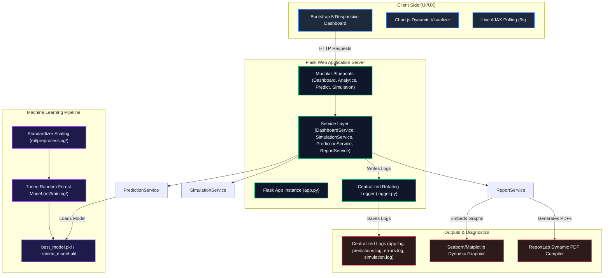
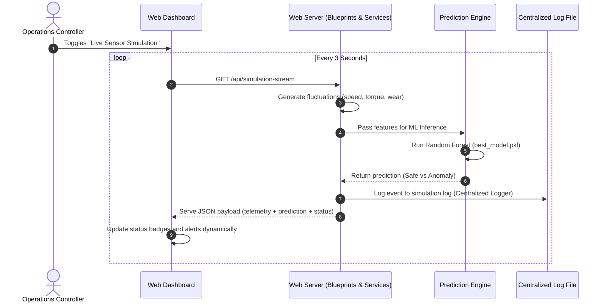

# 🔧 Tuned Predictive Maintenance System (PredMaint)

A production-grade, presentation-ready Machine Learning and Web Application suite designed to monitor, simulate, and predict industrial machinery failures in real-time. This system is trained on the standard `ai4i2020.csv` synthetic dataset representing 10,000 industrial operating units.

---

## 🛠️ Technology Stack & Badges

To deliver maximum responsive design, dynamic client-side analytics, and isolated model execution pipelines, this project utilizes a modern professional stack:


---

## 📝 Project Overview

Industrial downtime is extremely expensive. **PredMaint** implements a **Clean Architecture** application designed to classify machinery states into **Healthy Operations** or **Flagged Anomalies**. By using an optimal, tuned machine learning model and streaming simulated sensor feeds asynchronously into the web console, plant operations controllers can diagnose high-stress torque or speed anomalies before actual mechanical failures occur.

### Core Architectural Goals:
1. **Clean Separation of Concerns**: decodes core Flask route blueprints completely from prediction services, simulation engines, and reporting components.
2. **Leak-Free ML Pipeline**: Data standardization scales fit strictly on the train splits, preventing metrics pollution.
3. **Enterprise Production Logging**: Centralized isolated Rotating handlers separating activity, predictions, telemetry simulation, and critical errors cleanly.
4. **Professional UI/UX**: Custom Bootstrap 5 layout paired with interactive Chart.js widgets and async polling scripts.

---

## 🏗️ System Architecture

The blueprint below represents the system architecture, detailing the decouplings between clients, application routers, ML artifacts, and centralized diagnostics loggers:



---

## 📂 Folder Structure

```
Predictive-Maintenance/
│
├── backend/                             # Web Application Server Root
│   ├── app/
│   │   ├── config/                      # Configuration Layer
│   │   │   └── settings.py              # Environment variables & constants
│   │   ├── routes/                      # Route Blueprints
│   │   │   ├── analysis_routes.py       # Metrics page and stats views
│   │   │   ├── api_routes.py            # JSON feeds for dynamic client-side charts
│   │   │   ├── dashboard_routes.py      # Home landing page with predictive data table
│   │   │   ├── prediction_routes.py     # Manual single-record form inference route
│   │   │   ├── report_routes.py         # Dynamic PDF attachment download endpoint
│   │   │   └── simulation_routes.py     # Real-time sensor stream REST endpoint
│   │   ├── services/                    # Business Logic Layer
│   │   │   ├── analysis_service.py      # Target counting utility
│   │   │   ├── dashboard_service.py     # Resolves validation stats & aggregates dynamically
│   │   │   ├── prediction_service.py    # Interfaces with serialized ML pipelines
│   │   │   ├── report_service.py        # Compiles dynamic ReportLab PDFs
│   │   │   ├── simulation_service.py    # Generates physics telemetry fluctuations
│   │   │   └── visualization_service.py # Registers graph plots
│   │   ├── static/                      # Dynamic Web Assets
│   │   │   ├── css/                     # Styling custom overrides
│   │   │   └── js/                      # Chart.js plotters & AJAX AJAX streaming engines
│   │   │       ├── analytics.js
│   │   │       ├── charts.js
│   │   │       ├── dashboard.js
│   │   │       └── live_dashboard.js
│   │   ├── templates/                   # Jinja2 Layout Files
│   │   │   └── dashboard/
│   │   │       ├── analytics.html
│   │   │       ├── index.html
│   │   │       └── predictions.html
│   │   └── app.py                       # Flask Application Factory Pattern
│   └── run.py                           # Bootstrapper Entry script (handles Windows UTF-8 & paths)
│
├── docs/                                # Technical Documentation & Visuals
│   ├── architecture/                    # Workflows & Mermaid maps
│   ├── report/                          # Technical pipeline validation reports
│   └── screenshots/                     # UI visual captures
│
├── ml/                                  # Machine Learning Engineering Root
│   ├── data/                            # Raw and split CSV sets
│   ├── preprocessing/                   # standardized pipeline cleaning
│   │   └── preprocess.py                # Fitting scaler on train split cleanly
│   ├── training/                        # Pipeline selection & grid search
│   │   └── train.py                     # Logistic Regression vs Decision Trees vs Random Forest
│   ├── analysis/                        # Model validation metrics
│   │   └── evaluate.py                  # Generates heatmap PNGs & F1 statistics
│   └── models/                          # Serialized pipeline parameters (.pkl files)
│
├── outputs/                             # Dynamic operational outputs (gitignore protected)
│   ├── graphs/                          # Programmatically saved Seaborn heatmaps
│   ├── logs/                            # Rotating log files (app, predictions, errors, simulation)
│   ├── predictions/                     # CSV predictions output
│   └── reports/                         # Compiled dynamic PDF reports
│
├── tests/                               # Verification suite (Flask and ML checks)
├── requirements.txt                     # Installation dependencies list
└── README.md                            # Professional master developer overview
```

---

## 🚀 Machine Learning Pipeline

Our predictive modeling processes dataset records through four sequential decoupled steps:

```
[Ingest Raw Data] 
       │
       ▼
[Train-Test Split] ──► (Holdout 20% test partition for leak-proof scaling)
       │
       ▼
[Fit standard Scaler] ──► (Fitted strictly on 80% train partition)
       │
       ▼
[Multi-Classifier Selection] ──► (Logistic Regression vs Decision Trees vs Random Forest)
       │
       ▼
[Grid Search Fine-Tuning] ──► (Optimizes hyperparameters for F1 score metric)
       │
       ▼
[Pipeline Serialization] ──► (Saves best_model.pkl and X_test/y_test splits)
```

### Optimal Model Validation Stats:
- **Tuned Model Selected**: Random Forest (Hyperparameters tuned: `n_estimators=100`, `max_depth=15`, `min_samples_split=5`)
- **Validation Accuracy**: **`98.55%`**
- **Validation Precision**: **`0.8824`**
- **Validation Recall**: **`0.6618`**
- **Validation F1-Score**: **`0.7563`**

---

## 🖥️ Responsive Web Dashboard & Features

PredMaint features an executive-grade dashboard UI styled using custom dark glassmorphism and modern colors:

1. **Analytical Performance View (`/analysis`)**: Renders dynamic metrics directly from the preprocessed split scores, displays text classification reports, and embeds programs-plotted feature ranking charts.
2. **Dynamic PDF Generation**: A custom button compiles dynamic operational results, aggregates statistics, embeds heatmap charts, formats page numbers (`Page X of Y`), and serves a secure PDF attachment via a click event.
3. **Interactive Charting Engine (`/api/*`)**: Uses AJAX to fetch JSON data feeds on model comparisons, binary distributions, and feature importances, rendering Chart.js visualizations dynamically.
4. **Live Sensor Simulator**: Launches a physics-based simulator updating temperatures, RPM, and wear accumulation every 3 seconds to execute immediate model classifications:
   - **`HEALTHY`**: Standard normal parameters.
   - **`WARNING`**: High tool wear (>175 min) or excessive torque stress (>50 Nm).
   - **`CRITICAL`**: Real-time ML classifier flags a failing condition!

### System Operations Telemetry Workflow:



---

## 🔌 API Documentation

| Endpoint | Method | Response Format | Purpose |
| :--- | :--- | :--- | :--- |
| `/` | `GET` | HTML | Renders the primary dashboard analytics, displaying aggregated metrics and prediction previews. |
| `/predictions` | `GET` | HTML | Serves the manual telemetry parameter input form page. |
| `/predict` | `POST` | HTML | Accepts manual form parameters and renders classification results. |
| `/analysis` | `GET` | HTML | Serves the model analytics report view, embedding pipeline graphs. |
| `/analysis/download-pdf` | `GET` | PDF Attachment | Generates and compiles dynamic operational PDF diagnostic reports. |
| `/api/dashboard-metrics` | `GET` | JSON | Feeds current total/anomaly counts and validation performance scores. |
| `/api/model-comparison` | `GET` | JSON | Serves metrics details for all classifiers for comparison plots. |
| `/api/prediction-summary` | `GET` | JSON | Feeds binary distribution parameters (Healthy vs Failure). |
| `/api/feature-importance` | `GET` | JSON | Feeds optimal relative feature weights. |
| `/api/simulation-stream` | `GET` | JSON | Feeds live simulated telemetry values and prediction states. |

---

## 💾 Installation & Setup Instructions

Ensure you have **Python 3.11+** installed on your system.

### 1. Clone & Navigate
```bash
git clone https://github.com/your-username/Predictive-Maintenance.git
cd Predictive-Maintenance
```

### 2. Configure Virtual Environment
On Windows (PowerShell):
```powershell
python -m venv venv
.\venv\Scripts\activate
```
On Linux/macOS:
```bash
python3 -m venv venv
source venv/bin/activate
```

### 3. Install Dependencies
```bash
pip install -r requirements.txt
```

---

## 🏃 Run the Application

The server is equipped with dynamic path routing and UTF-8 validation switches for clean environment boots.

### Start the Flask Web App
On Windows (PowerShell):
```powershell
$env:PYTHONUTF8=1
python backend/run.py
```
On Linux/macOS:
```bash
export PYTHONUTF8=1
python backend/run.py
```

Open your browser and navigate to: **`http://127.0.0.1:5000/`**

---

## 📸 Screenshots & UI Previews

> [!NOTE]
> Below are structural preview outlines demonstrating our custom-designed dark glassmorphism Operations Dashboard.

```
┌───────────────────────────────────────────────────────────────────────────────────┐
│ 🔧 PREDMAINT DIAGNOSTIC SYSTEM  [Home]  [Manual Prediction]  [Model Analytics]     │
├───────────────────────────────────────────────────────────────────────────────────┤
│                                                                                   │
│  ┌──────────────────┐  ┌──────────────────┐  ┌──────────────────┐  ┌───────────┐  │
│  │ Ingested Records │  │ Healthy Machines │  │ Anomaly Flagged  │  │ Accuracy  │  │
│  │     10,000       │  │      9,660       │  │       340        │  │  98.55%   │  │
│  └──────────────────┘  └──────────────────┘  └──────────────────┘  └───────────┘  │
│                                                                                   │
│  ┌──────────────────────────────────────┐  ┌───────────────────────────────────┐  │
│  │ Operational Anomaly Distribution     │  │ Tuned Optimal Feature Importance  │  │
│  │  [ doughnut chart widget showing     │  │  [ horizontal bar chart ranking   │  │
│  │    96.6% safe vs 3.4% failure ]      │  │    Torque & Speed as key indicators] │  │
│  └──────────────────────────────────────┘  └───────────────────────────────────┘  │
│                                                                                   │
│  ┌─────────────────────────────────────────────────────────────────────────────┐  │
│  │ Dynamic Sensor Telemetry Stream Simulator    [ Live Polling Stream Status ]  │  │
│  │   Air Temp: 298.5K  |  Speed: 1492 RPM  |  Torque: 42 Nm  |  Wear: 12 min    │  │
│  │   Pipeline Inference: ✅ Safe           Operational Status: [ HEALTHY ]     │  │
│  └─────────────────────────────────────────────────────────────────────────────┘  │
└───────────────────────────────────────────────────────────────────────────────────┘
```

---

## 🔮 Future Scope

In future versions, the predictive maintenance suite can be scaled by implementing:
- **Time-Series Deep Learning Forecasting**: Integrate LSTM networks to predict parameter drift (e.g. tool wear wear-out profiles) days before failures manifest.
- **Relational Storage Layer**: Replace baseline CSV polling configurations with database logging (PostgreSQL or SQLite) to record all manual and streaming inference payloads securely.
- **Docker Containerization**: Deliver isolated environments with `Dockerfile` and `docker-compose` setups for simplified local runs or cloud deployments.
- **Prometheus/Grafana Metrics**: Expose specialized Prometheus endpoints to monitor operational API health in cloud environments.

---

## 👤 Author Information

Designed and developed with care by **Harshavardhan** — Graduate MSc Software Engineering Candidate and Technical DevOps Practitioner.

---

## 📄 License

This project is licensed under the MIT License — see the [LICENSE](LICENSE) file for details.
