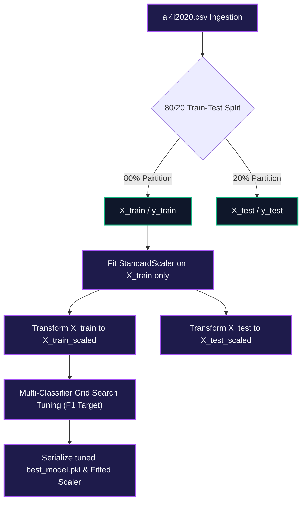
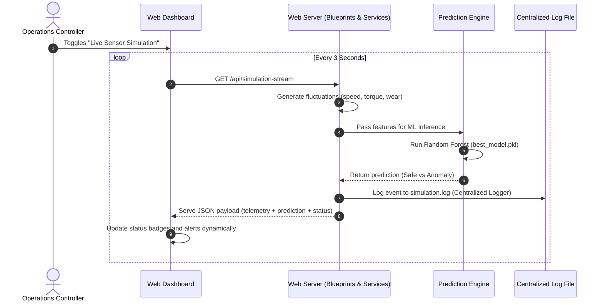

# 🏗️ Predictive Maintenance System - System Architecture Document

This document provides a highly comprehensive technical breakdown of the architecture, design choices, data flow pipelines, and design pattern decodings integrated across the **PredMaint** application.

---

## 1. Architectural Style: Clean Architecture & Decoupled Modular Blueprints

The application is structured strictly following the **Clean Architecture / Clean MVC** design principles, separating boundaries between UI controllers, core business logic services, data models, and static pipeline configurations:

- **Config Layer (`backend/app/config/settings.py`)**: Centralizes target categories, feature lists, and dynamic local file paths, preventing hardcoding.
- **Route Blueprints Layer (`backend/app/routes/`)**: Act as modular, independent routing controllers for isolated system functions (Dashboard views, API endpoints, Prediction inputs, Simulation streaming, and PDF downloading).
- **Service Layer (`backend/app/services/`)**: Houses the primary business logic. Routes invoke services which in turn access ML models or report generators, keeping routing handlers lightweight.
- **Utility Layer (`backend/app/utils/`)**: Houses centralized isolated rotators, model loader caching wrappers, standardizer scaling routines, and print helpers.

```
┌─────────────────────────────────────────────────────────────┐
│                       Client Dashboard UI                   │
│          (Bootstrap 5 Template + Chart.js Asynchronous APIs) │
└──────────────────────────────┬──────────────────────────────┘
                               │ HTTP Requests
                               ▼
┌─────────────────────────────────────────────────────────────┐
│                 Flask Blueprints Routing Controllers         │
│          (dashboard_routes, prediction_routes, api_routes)  │
└──────────────────────────────┬──────────────────────────────┘
                               │ Invokes Services
                               ▼
┌─────────────────────────────────────────────────────────────┐
│                      Service Logic Layer                    │
│      (PredictionService, SimulationService, ReportService)  │
└──────────────────────────────┬──────────────────────────────┘
                               │ Loads & Processes
                               ▼
┌─────────────────────────────────────────────────────────────┐
│             serialized ML Assets & dynamic Outputs           │
│           (best_model.pkl, outputs/logs/, outputs/reports)   │
└─────────────────────────────────────────────────────────────┘
```

---

## 2. Leak-Proof Machine Learning Pipeline Architecture

In predictive analytics, standardizing values across both partitions before splitting introduces **validation data leakages** which falsely inflates model precision metrics. **PredMaint** completely prevents this:

1. **Splitting Precedes Scaling**: The raw synthetic dataset is split into `80%` training data and `20%` test data *prior* to scaling.
2. **Train Set Scaling Fit**: The `StandardScaler` is fitted *exclusively* on the `80%` training split.
3. **Downstream Standardizations**: The fitted scaler is then applied to transform both the train split and test split independently.
4. **Grid-Search Tuning**: Hyperparameters are optimized via 5-fold cross-validation grid search targeted strictly on F1-Score metrics to balance warning alerts with precision accuracy.



---

## 3. Centralized Rotating Logging System Architecture

To ensure enterprise-grade production readiness, we established a centralized, non-overlapping logging matrix. Activity, inferences, simulation streams, and critical exceptions are routed separately to individual rotating log files:

```mermaid
graph LR
    classDef src fill:#1e293b,stroke:#3b82f6,stroke-width:1px;
    classDef lgr fill:#0f172a,stroke:#10b981,stroke-width:2px,color:#f8fafc;
    classDef out fill:#2d1b1b,stroke:#f43f5e,stroke-width:1px;

    Routes["Blueprints Controllers"]:::src --> loggerpy["logger.py isolated loggers"]
    Services["Service Logic Classes"]:::src --> loggerpy
    ModelLoader["Model Loader Utility"]:::src --> loggerpy
    
    loggerpy --> app_activity:::lgr
    loggerpy --> predictions_activity:::lgr
    loggerpy --> simulation_activity:::lgr
    loggerpy --> errors_activity:::lgr
    
    app_activity --> app.log["outputs/logs/app.log"]:::out
    predictions_activity --> predictions.log["outputs/logs/predictions.log"]:::out
    simulation_activity --> simulation.log["outputs/logs/simulation.log"]:::out
    errors_activity --> errors.log["outputs/logs/errors.log"]:::out
```



### Key Configurations:
- **Encoding Protection**: Global standard UTF-8 encoding configuration inside Rotating handlers, maintaining native compatibility with Windows terminal platforms.
- **Propagation Deactivation (`propagate = False`)**: Prevents logging bubbles from bleeding into root logging configurations, avoiding console duplication anomalies.
- **Logger Bridge Pattern**: Implements standard bridge routes inside heavy services to route legacy logging statements seamlessly to specialized streams without massive codebase re-engineering.

---

## 4. Sequential Telemetry Simulation Workflow

When the Operations Dashboard controller activates the live sensor telemetry stream, a background asynchronous sequence is initialized to telemetrically process sensor parameters:



### Physical Boundaries & Inverse Proportional Physics:
- **Temperature Modeling**: Air temperature fluctuates within `297K - 302K`. Process temperature is dynamically simulated at `Air Temperature + ~10K`.
- **Inverse Proportional Speed-Torque Correlation**: Modulates rotational speed (`1420 - 1580 rpm`) inversely against torque load (`39 - 47 Nm`).
- **Anomaly Injection (8% baseline)**: Periodic anomalies dynamically inject critical speed drops (`980 - 1150 rpm`) and high torque friction spikes (`62 - 78 Nm`), driving instant machine learning model predictions.
